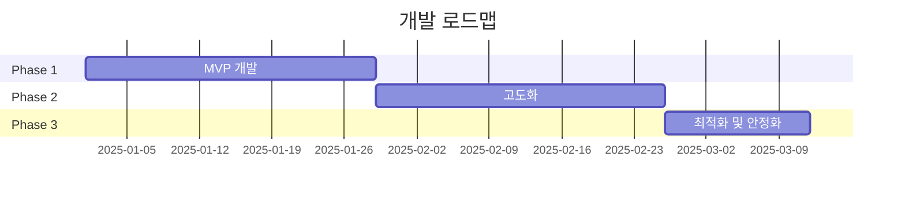

<!-- _class: lead -->
<!-- _paginate: false -->

# Steam Value Insights (SVI)

## 스팀 게임의 진짜 가성비를 분석하는 데이터 대시보드

**데이터 기반 스마트 구매 의사결정 플랫폼**

---

## 📋 목차

1. 프로젝트 개요
2. 문제 정의 및 배경
3. 타겟 사용자
4. 핵심 기능
5. 기술 스택
6. 개발 로드맵
7. 성공 지표 (KPI)
8. 전략적 기대 효과

---

<!-- _class: lead -->

# 1. 프로젝트 개요

---

## 제품 설명

> 스팀의 방대한 할인 데이터 속에서 **단순한 가격 인하율이 아닌**, 
> 실제 구매 가치와 기회비용을 분석하여 
> 최적의 구매 의사결정을 돕는 데이터 분석 대시보드

### 제품 비전

게이머들이 한정된 예산으로 최대의 즐거움을 얻을 수 있도록, 
**데이터 기반의 스마트한 구매 의사결정**을 지원하는 필수 도구

---

<!-- _class: lead -->

# 2. 문제 정의 및 배경

---

## 현재 사용자들이 겪는 문제

### 🤔 정보 과부하 상태

스팀의 잦은 세일과 방대한 게임 수로 인해 
**어떤 게임을 지금 사는 것이 가장 이득인지** 판단하기 어려움

---

## 주요 페인 포인트

| 문제 | 설명 |
|------|------|
| ❌ **가짜 할인** | 할인율이 높아도 실제로 최저가가 아닌 경우가 많음 |
| ❌ **라이브러리 채우기** | 구매 후 플레이하지 않는 게임이 쌓임 |
| ❌ **숨겨진 명작 발굴 어려움** | 마케팅에 묻힌 고품질 게임을 찾기 어려움 |
| ❌ **가치 판단 어려움** | 가격 대비 실제 플레이 가치를 알 수 없음 |

---

## 프로젝트 목적

1. **가격 데이터 + 플레이 시간 데이터** 결합한 가성비 지표 제공

2. **단순 할인율이 아닌** 역대 최저가 비교를 통한 구매 시점 제언

3. **데이터 기반의 숨겨진 명작 발굴**로 사용자 만족도 제고

4. **합리적인 구매 의사결정**을 통한 게임 라이브러리 활용도 향상

---

<!-- _class: lead -->

# 3. 타겟 사용자

---

## Primary Persona: 합리적 게이머 "민수"


- **연령**: 25-35세
- **특징**: 한정된 예산으로 최대의 즐거움을 찾는 합리적 소비자
- **니즈**: 구매 후 후회하지 않을 게임을 찾고 싶음
- **행동 패턴**: 세일 기간마다 스팀을 방문하지만 무엇을 살지 결정하기 어려워함

---

## Secondary Persona: 인디 게임 탐색가 "지은"


- **연령**: 20-30세
- **특징**: 대작(AAA) 게임 외에 자신의 취향에 맞는 고퀄리티 인디 게임을 찾는 탐색가
- **니즈**: 마케팅에 묻힌 숨겨진 명작을 발견하고 싶음
- **행동 패턴**: 리뷰와 평점을 꼼꼼히 확인하며 새로운 게임을 탐색

---

## Tertiary Persona: 실용적 소비자 "현우"


- **연령**: 30-40세
- **특징**: 구매 후 플레이하지 않는 게임을 줄이고 실용적 소비를 지향
- **니즈**: 실제로 플레이할 가치가 있는 게임만 구매하고 싶음
- **행동 패턴**: 구매 전 충분한 조사를 하며 신중하게 결정

---

<!-- _class: lead -->

# 4. 핵심 기능

---

## 4.1 VPI (가성비 지수) 산출

### 📊 Value-to-Price Index

게임의 예상 플레이 시간 대비 현재 가격의 효율성을 수치화

```
VPI = (예상 플레이 시간 / 현재 가격) × 1000
```

### 출력 형식
- **1,000원당 즐길 수 있는 시간**(시간 단위)으로 표시
- 높은 순으로 정렬하여 순위 제공

**우선순위**: P0 (필수)

---

## VPI 계산 예시

| 게임 | 플레이 시간 | 가격 | VPI | 의미 |
|------|------------|------|-----|------|
| 게임 A | 50시간 | ₩20,000 | **2.5** | 1,000원당 2.5시간 |
| 게임 B | 100시간 | ₩30,000 | **3.3** | 1,000원당 3.3시간 |
| 게임 C | 30시간 | ₩50,000 | **0.6** | 1,000원당 0.6시간 |

→ **게임 B가 가장 높은 가성비!**

---

## 4.2 스마트 구매 신호등

### 🚦 Purchase Signal

현재 할인가가 역대 최저가(All-time Low)와 얼마나 근접한지 시각적으로 표시

---

## 신호등 구분

| 신호 | 조건 | 메시지 |
|------|------|--------|
| 🟢 **BEST** | 역대 최저가 경신 또는 동일 | "지금이 최적 구매 시점입니다" |
| 🟡 **GOOD** | 역대 최저가와 10% 이내 차이 | "좋은 가격입니다" |
| 🔴 **WAIT** | 이전 할인폭보다 낮음 | "더 기다리는 것을 권장합니다" |

**우선순위**: P0 (필수)

---

## 4.3 Hidden Gem 발굴

### 💎 데이터 기반 틈새 시장 발굴

마케팅 자본에 가려진 고득점 게임을 필터링하여 추천

### 필터링 로직

```
조건 1: 긍정적 평가 비율 ≥ 90%
AND
조건 2: 총 리뷰 수 ≤ 1,000개
AND
조건 3: 현재 할인율 ≥ 50%
```

**우선순위**: P1 (중요)

---

## 4.4 역대 가격 변동 그래프

### 📈 Price History Chart

선택한 게임의 가격 변동 히스토리를 시각화

**표시 정보:**
- 최근 1년간 가격 변동 추이
- 역대 최저가 표시
- 주요 세일 이벤트 마커 (여름 세일, 겨울 세일)

**우선순위**: P1 (중요)

---

## 4.5 필터 및 정렬 기능

### 🔍 고급 필터링

**필터 옵션:**
- 장르 (액션, RPG, 인디, 시뮬레이션 등)
- 가격 범위 (₩0-10,000, ₩10,000-30,000 등)
- 할인율 (50% 이상, 75% 이상 등)
- 평가 점수 (긍정적 평가 90% 이상 등)

**정렬 옵션:**
- VPI 지수 높은 순 / 할인율 높은 순 / 가격 낮은 순 / 평가 점수 높은 순

**우선순위**: P0 (필수)

---

## 4.6 메타 정보 통합 표시

### 📊 종합 게임 정보

- 메타크리틱 점수
- 스팀 평가 점수 및 리뷰 수
- 예상 플레이 시간 (메인 스토리, 컴플리트)
- 출시일
- 개발사/퍼블리셔

**우선순위**: P1 (중요)

---

<!-- _class: lead -->

# 5. 기술 스택

---

## 백엔드 기술 스택

### 🔧 Backend

| 기술 | 용도 |
|------|------|
| **Python 3.11+** | 프로그래밍 언어 |
| **FastAPI** | API 서버 프레임워크 |
| **Pandas** | 데이터 분석 |
| **APScheduler** | 정기 데이터 수집 |
| **PostgreSQL** | 데이터 저장 |
| **SQLAlchemy** | ORM |

---

## 프론트엔드 기술 스택

### 🎨 Frontend

| 기술 | 용도 |
|------|------|
| **React 18+** | UI 프레임워크 |
| **TypeScript** | 타입 안정성 |
| **Tailwind CSS** | 스타일링 |
| **Chart.js** | 가격 그래프 시각화 |
| **Vite** | 빌드 도구 |

---

## 데이터 소스

### 📊 External APIs

1. **CheapShark API**
   - 용도: 가격 정보 및 역대 최저가
   - 업데이트 주기: 1시간마다

2. **HowLongToBeat (HLTB)**
   - 용도: 플레이 시간 데이터
   - 업데이트 주기: 주 1회

3. **SteamSpy API**
   - 용도: 리뷰 수 및 소유자 추정치
   - 업데이트 주기: 일 1회

---

## 인프라

### 🚀 DevOps

| 기술 | 용도 |
|------|------|
| **Docker** | 컨테이너화 |
| **GitHub Actions** | CI/CD |
| **Redis** | 캐싱 (Phase 3) |

---

<!-- _class: lead -->

# 6. 개발 로드맵

---

## Phase 1: MVP 개발 (4주)

### 주요 목표

- ✅ 프로젝트 초기 설정
- ✅ 외부 API 연동 (CheapShark, HLTB, SteamSpy)
- ✅ 데이터 수집 파이프라인 구축
- ✅ VPI 및 구매 신호등 로직 구현
- ✅ 백엔드 API 개발
- ✅ 메인 대시보드 UI 개발

**완료 기준**: 기본 기능 동작하는 UI 완성

---

## Phase 2: 고도화 (4주)

### 주요 목표

- 🚧 Hidden Gem 필터 구현
- 🚧 가격 변동 그래프 추가
- 🚧 게임 상세 페이지 개발
- 🚧 메타크리틱 정보 통합
- 🚧 반응형 디자인 적용

**완료 기준**: 모든 P1 기능 구현 완료

---

## Phase 3: 최적화 및 안정화 (2주)

### 주요 목표

- 📅 성능 최적화 (쿼리, 캐싱)
- 📅 Redis 캐싱 전략 구현
- 📅 모니터링 시스템 구축
- 📅 사용자 피드백 반영
- 📅 버그 수정 및 안정화

**완료 기준**: 출시 준비 완료

---

## 전체 개발 일정



**총 개발 기간**: 10주

---

<!-- _class: lead -->

# 7. 성공 지표 (KPI)

---

## 기술적 KPI

| 지표 | 목표 |
|------|------|
| **데이터 정확도** | ≥ 99% |
| **API 응답 시간** | ≤ 2초 |
| **데이터 신선도** | ≤ 1시간 |
| **페이지 로딩 시간** | ≤ 2초 |

---

## 사용자 경험 KPI

| 지표 | 목표 |
|------|------|
| **평균 세션 시간** | ≥ 5분 |
| **세션당 페이지 뷰** | ≥ 10 |
| **월간 재방문율** | ≥ 40% |
| **사용자 만족도** | ≥ 4.0/5.0 |

---

## 비즈니스 KPI

| 지표 | 목표 |
|------|------|
| **찜 목록 추가율** | ≥ 20% |
| **스팀 스토어 클릭률** | ≥ 30% |
| **Hidden Gem 추천 만족도** | ≥ 4.0/5.0 |
| **월간 활성 사용자(MAU)** | ≥ 1,000명 |

---

<!-- _class: lead -->

# 8. 전략적 기대 효과

---

## 경영전략 기획 역량 입증

이 프로젝트는 단순한 도구 개발을 넘어, 
**복잡한 데이터를 가공하여 의사결정 모델을 구축**하는 과정을 보여줍니다.

---

## 핵심 역량 증명

### 1. 📊 데이터 분석 능력
다양한 데이터 소스를 통합하여 의미 있는 인사이트 도출

### 2. 🎯 문제 해결 능력
사용자의 실제 페인 포인트를 파악하고 해결책 제시

### 3. 💡 전략적 사고
단순 기능 나열이 아닌 사용자 가치 중심의 제품 설계

### 4. 🚀 실행력
기획부터 구현까지 전 과정을 주도적으로 수행

---

## 향후 확장 가능성

### 기능 확장
- 개인화 추천 알고리즘 (머신러닝)
- 가격 알림 기능
- 친구와 게임 비교 기능
- 게임 번들 최적화 분석

### 플랫폼 확장
- 모바일 앱 개발
- 브라우저 확장 프로그램
- Discord 봇 통합

---

### 데이터 확장
- Epic Games Store 데이터 통합
- GOG.com 데이터 통합
- 콘솔 게임 가격 비교

---

<!-- _class: lead -->

# 사용자 흐름 (User Flow)

---

## 메인 사용 시나리오

```
1. 메인 접속
   ↓
2. 현재 할인 중인 전체 리스트 확인
   ↓
3. 필터 설정 (장르, 예산 범위 등)
   ↓
4. 데이터 정렬 (VPI 지수 또는 구매 신호 우선순위)
   ↓
5. 관심 게임 선택
   ↓
6. 상세 정보 확인 (가격 그래프, 메타 점수 등)
   ↓
7. 구매 결정 → 스팀 스토어 페이지로 이동
```

---

## Hidden Gem 발굴 시나리오

```
1. 메인 접속
   ↓
2. "숨겨진 명작" 필터 활성화
   ↓
3. 추천 리스트 확인
   ↓
4. 게임 상세 정보 탐색
   ↓
5. 찜 목록 추가 또는 즉시 구매
```

---

<!-- _class: lead -->

# 출시 기준

---

## 출시 체크리스트

### 기능 완성도
- ✅ 모든 P0 기능 구현 완료
- ✅ 주요 P1 기능 구현 완료
- ✅ 모든 기능 테스트 통과

### 품질 보증
- ✅ 데이터 정확도 95% 이상
- ✅ 페이지 로딩 시간 3초 이내
- ✅ 주요 브라우저 호환성 확보
- ✅ 모바일 반응형 디자인 완료

---

<!-- _class: lead -->

# 감사합니다! 🎉

## Steam Value Insights

**데이터 기반 스마트 구매 의사결정 플랫폼**

---

### 📞 Contact

- **GitHub**: https://github.com/tlstn3172/steam-discount-demo
- **Email**: your.email@example.com

---

<!-- _class: lead -->

# Q&A

질문이 있으시면 언제든지 말씀해주세요! 😊
